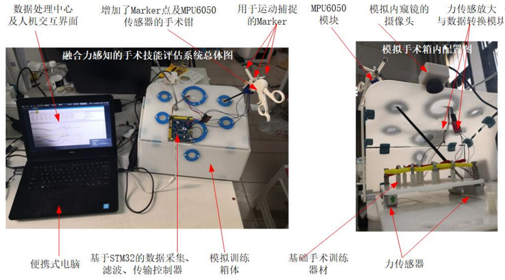

# 作品集

## 1.第十三届恩智浦智能车竞赛

### 1.1 简介

全国大学生智能汽车竞赛是以智能汽车为研究对象的创意性科技竞赛，是面向全国大学生的一种具有探索性工程实践活动，是教育部倡导的大学生科技竞赛之一。

参加的是传统组别——光电四轮组，主要负责车模机械机构的维护、处理二值化摄像头数据判断赛道元素、巡线算法编写、程序UI设计与电机PID控制；实现智能小车在指定赛道上快速到达终点。得益于团队的努力与协作，最终再国赛中获得二等奖。

### 1.2 系统框图

图1 程序整体流图

### 1.3 实物图

图2 智能车B车模

## 2.第十四届恩智浦智能车竞赛

### 2.1 简介

同样是智能车竞赛，不过这次参加的是新设置的室外光电组。在本次比赛中，主要负责车模机械结构维护，SLAM（实时定位与建图）算法编写与调试，IMU数据处理，根据比赛场地环境使机器人通过激光雷达自主构建环境的栅格地图，并根据导航算法从起点到达终点。

得益于团队的努力与协作，最终再国赛中获得三等奖。

### 2.2 系统框图

图3 小车软件总体框架

图4 小车硬件总体框架

### 2.3 实物图

图5 室外组车模

## 3.多功能电磁锁

### 3.1 简介

项目设计是以STM32F103C8T6微控制器为控制核心，通过指纹传感器、矩阵键盘、蓝牙模块实现指纹、密码、蓝牙模块解锁，让开锁方式多样；利用ESP8266模块实现远程开锁，并加入蜂鸣器报警，实现安全性；结合液晶屏实现人性化显示界面并利用ESP8266作为网络接口，结合HomeKit实现语音控制，实现便捷性；结合辅助模块保证可靠性。硬件方面设计了最小系统、电源模块，结合指纹传感器、蓝牙模块、ESP8266、矩阵键盘等系统硬件模块。系统实现了指纹、密码、蓝牙三种解锁功能。

### 3.2 系统框图

图6 多功能电磁锁系统框图

### 3.3 实物图

图7 电磁锁实物图

图8 电磁锁PCB图

## 4.基于多模信息的手术技能训练评估系统

### 4.1 项目简介

项目是本人的毕业设计，基于重力传感器、高清摄像头、MPU6050以及光学运动捕捉系统对腹腔镜手术训练箱进行改造，实现了获取手术过程中的运动、交互力和视觉三种模态数据。对持针钳与组织间的力、训练者手持手术器械的姿态以及手术器械的关键点信息进行分析，并将分析的结果作为评分系统的评估数据。 

### 4.2 系统框图

图9 训练系统框图

图10 评分系统计算过程

### 4.3 实物图

图11 基于多模信息的手术技能训练评估系统

## 5.基于SLAM的清洁机器人

### 5.1 简介

项目是实验室课题，面向家庭环境基于ROS与SLAM框架的智能扫地机器人整体设计方案。
在组内负责机器人沿墙清扫功能设计，包括底层驱动编写，移植ROS通信协议、沿墙算法设计，实现器人沿墙清扫功能，并经过优化、调试，保证对墙边的清洁效果达95%以上；
负责机器人自启动功能设计，包括上层自动程序、shell脚本、下次电池监控程序编写，实现机器人充电完成后自动开机清扫，机器人能够无人监管循环稳定运行24小时以上。 

### 5.2 实物图

图12 清洁机器人实物图

## 6.基于SLAM的室外导盲服务机器人

### 6.1 简介

项目是实验室课题，设计一款面向盲人群体室外出行的移动服务机器人。
作为组内的负责人，分析室外导盲需求，和组员讨论制定系统设计方案，初步设计导盲机器人样机，将普通电动轮椅改造导盲轮椅。
负责机器人室外自动定位，包括：高德地图数据请求、GPS与IMU数据融合，移植并优化局部路径规划导航算法，实现机器人远距离导航与自主避障。 

### 6.2 实物图

图13 移动机器人样机

图14 导盲轮椅样机

## 7.奖状证书类附件

